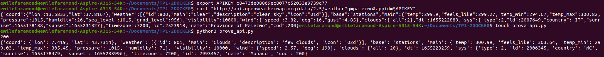

## DEVOPS - TP1 et 2 - DOCKER
## TP1
##FARAMOND Emile

Image DockerHub: 
https://hub.docker.com/r/emilefrd/docker-dockertp1-2

# Pre requis : 
> avoir installé un environnement virtuel

> créer un compte sur openweather et récupérer sa clé

> créer un compte docker

### Lignes de commandes : 

## TP2
